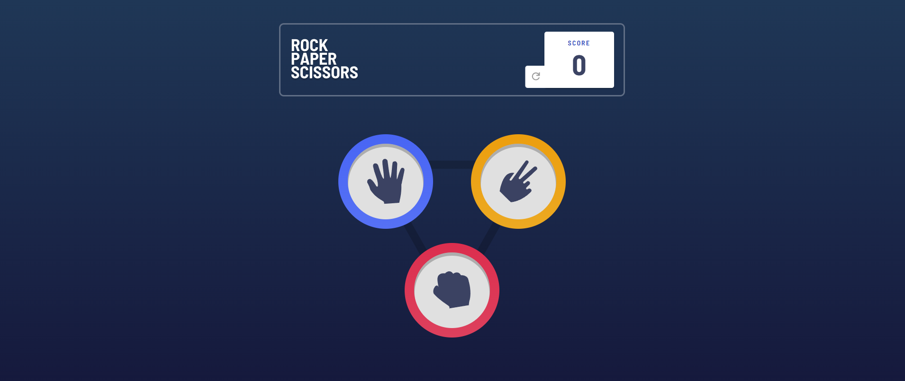

# Frontend Mentor - Rock, Paper, Scissors solution

This is a solution to the [Rock, Paper, Scissors challenge on Frontend Mentor](https://www.frontendmentor.io/challenges/rock-paper-scissors-game-pTgwgvgH). Frontend Mentor challenges help you improve your coding skills by building realistic projects. 

## Table of contents

- [Overview](#overview)
  - [The challenge](#the-challenge)
  - [Screenshot](#screenshot)
  - [Links](#links)
- [My process](#my-process)
  - [Built with](#built-with)
  - [What I learned](#what-i-learned)
  - [Continued development](#continued-development)
- [Author](#author)

## Overview

### The challenge

Users should be able to:

- View the optimal layout for the game depending on their device's screen size
- Play Rock, Paper, Scissors against the computer
- Maintain the state of the score after refreshing the browser _(optional)_

### Screenshot

### Links

- Solution URL: [Add solution URL here](https://your-solution-url.com)
- Live Site URL: [Add live site URL here](https://your-live-site-url.com)

## My process

### Built with

- Semantic HTML5 markup
- SASS variables
- Flexbox
- Mobile-first workflow
- [React](https://reactjs.org/) - JS library
- [Next.js](https://nextjs.org/) - React framework
- [SASS](https://styled-components.com/) - For styles

### What I learned

I learned how to use better global states and preserve their values between renders.

### Continued development

I want to continue exploring real challenges where I get out of my comfort zone like this one, where I had to learn a lot. So I intend to continue focusing deeper and deeper on javascript libraries/frameworks.

## Author

- Website - [Gabriel Crispim Portfolio](https://crispim-gabriel-roberto-crispims-projects.vercel.app/)
- Frontend Mentor - [@sirbiel100](https://www.frontendmentor.io/profile/sirbiel100)
- LinkedIn - [Gabriel Crispim](https://www.linkedin.com/in/gabrielrcrispim/)